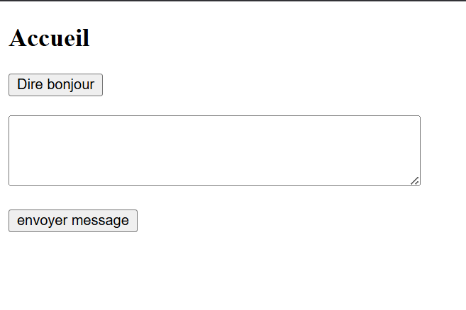
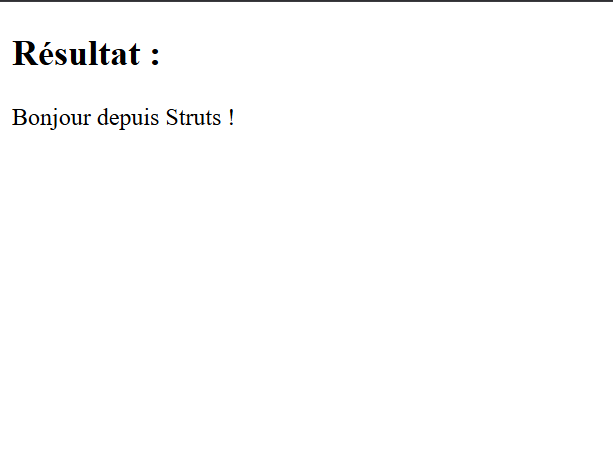
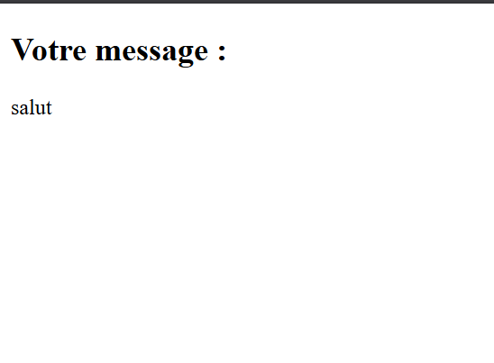

# struts1 basic test project

## repository maven :
(https://repo.maven.apache.org/maven2/struts/struts/)

## Dependencies/dépendances :
- javax.servlet version 4.0.1
- javax.servlet.jsp version 2.3.3
- org.eclipse.jetty version 9.4.51.v20230217
- struts version 1.2.9

# EN :

a small struts web project to understand the basics.

# Architecture

## Pages

- index.jsp: The site’s home page.
####

####
- result.jsp: Page displaying "Hello from struts" via the first button.
####

####
- message.jsp: Page displaying the message contained in the text tag after submission via the second button (in get so XSS reflected not important...)
####

####

## Routing
Three pages, redirect from 404 errors to index.jsp

# Definitions

## Javabean
A JavaBean is a standardized Java class designed to be a reusable software component. It follows strict conventions:
- Constructor without argument: It must have a public default constructor.
  ####
- Getters and Setters: Properties (private fields) are accessible via public methods named getNomPropriete() and setNomPropriete().
####
- Serializable (optional but common): It often implements the Serializable interface to allow the persistence of its state.
###
Its main purpose is to encapsulate data (such as form fields or database records) into a single object, thus facilitating their manipulation, transfer (for example, between a servlet and a JSP) and their reuse in different parts of an application.

## web.xml vs struts-config.xml
web.xml acts as the standard deployment descriptor for the web application, used to create the connection between the web container and the application, and is read by the container when the server starts up. struts-config.xml, by contrast, is the application-specific deployment descriptor Struts 1, used to establish the connection between the view and the controller, and is read by the ActionServlet servlet’s init() method.

The main differences lie in their role and loading time:

web.xml defines the ActionServlet and its URL mapping (typically *.do), acting as the framework’s single entry point for the container.
struts-config.xml configures specific action mappings, forms (ActionForms), results, and redirects, defining business logic and MVC model views.

The operating flow is sequential: when the server starts, the container reads web.xml to load and map the ActionServlet servlet, which then initiates the loading of struts-config.xml to determine how to process incoming requests to defined actions.

## Pom.xml
Pom.xml is a file that allows Maven to understand which dependencies to use and which version to choose for them

# Summary
- Strust-config.xml and web.xml act as router.
- ActionServlet acts as controller.
- Action acts like Model/buissness (business logic).
####
## schema:
Request → web.xml (route to ActionServlet) → struts-config.xml (decides the Action) → Action (business logic) → Forward → View (JSP)

# FR :

un petit projet Web Struts pour comprendre les bases.

# Architecture

## Pages

- index.jsp : Page d'acceuil du site.
####

####
- result.jsp : Page affichant "Bonjour depuis struts" via le premier bouton.
####

####
- message.jsp : Page affichant le message contenu dans la balise textarea après soumission via le deuxième bouton (en get donc XSS réfléchi pas important...)
####

####

## Routage

Trois pages, redirection des erreurs 404 vers index.jsp

# Définitions

## Javabean
Un JavaBean est une classe Java standardisée conçue pour être un composant logiciel réutilisable.  Elle suit des conventions strictes :
- Constructeur sans argument : Elle doit posséder un constructeur public par défaut.
  ####
- Accesseurs (Getters) et Mutateurs (Setters) : Les propriétés (champs privés) sont accessibles via des méthodes publiques nommées getNomPropriete() et setNomPropriete().
####
- Sérialisable (optionnel mais courant) : Elle implémente souvent l'interface Serializable pour permettre la persistance de son état.
###
Son but principal est d'encapsuler des données (comme les champs d'un formulaire ou des enregistrements de base de données) en un seul objet, facilitant ainsi leur manipulation, leur transfert (par exemple, entre une servlet et une JSP) et leur réutilisation dans différentes parties d'une application.

## web.xml vs struts-config.xml
web.xml agit comme le descripteur de déploiement standard de l'application web, servant à créer la connexion entre le conteneur web et l'application, et est lu par le conteneur lors du démarrage du serveur. struts-config.xml, en revanche, est le descripteur de déploiement spécifique à l'application Struts 1, utilisé pour établir la connexion entre la vue et le contrôleur, et est lu par la méthode init() de la servlet ActionServlet.

Les différences principales résident dans leur rôle et leur moment de chargement :

web.xml définit la servlet ActionServlet et son mapping d'URL (généralement *.do), agissant comme le point d'entrée unique du framework pour le conteneur.
struts-config.xml configure les mappages d'actions spécifiques, les formulaires (ActionForms), les résultats et les redirections, définissant ainsi la logique métier et les vues du modèle MVC.
Le flux de fonctionnement est séquentiel : lorsque le serveur démarre, le conteneur lit web.xml pour charger et mapper la servlet ActionServlet, qui initie ensuite le chargement de struts-config.xml pour déterminer comment traiter les requêtes entrantes vers les actions définies.

## Pom.xml
Pom.xml est un fichier permettant à maven de comprendre quelles dépendances utiliser et quelle version choisir pour ces dernières

# Résumé
- Strust-config.xml et web.xml agissent comme router.
- ActionServlet agit comme controller.
- Action agit comme Model/buissness (logique métier).
####
## schéma :
Requête → web.xml (route vers ActionServlet) → struts-config.xml (décide l’Action) → Action (logique métier) → Forward → Vue (JSP)

#Sources/Links :
- https://www.oracle.com/webfolder/technetwork/jsc/xml/ns/javaee/index.html
- https://stackoverflow.com/questions/17645028/problems-with-accented-characters-in-jsp
- https://stackoverflow.com/questions/13858183/why-do-we-need-global-forwards-and-global-exceptions-in-struts
- https://struts.apache.org/core-developers/web-xml
- https://jakarta.ee/specifications/servlet/4.0/apidocs/
- https://jetty.org/docs/jetty/10/programming-guide/maven-jetty/jetty-maven-helloworld.html
- https://struts.apache.org/maven-archetypes/
- https://struts.apache.org/getting-started/
